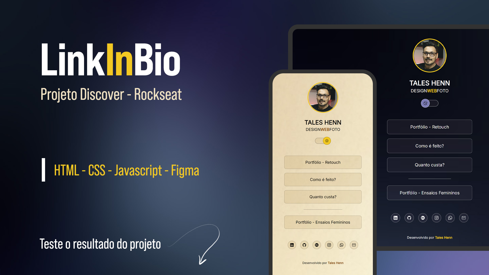

<p align="center">
  
</p>

## README.md

### Projeto Link in Bio (Agregador de links)

Este projeto é um agregador de links web estático para uso em "bio" de redes sociais.

#### Design

O design é minimalista e moderno, com uma paleta de cores escura e fontes de fácil leitura. O foco está no conteúdo, com destaque para o avatar e seus de portfólio.

#### Funcionalidades

- **Tema Escuro/Claro:** O usuário pode alternar entre o tema escuro (padrão) e um tema claro.
- **Links Externos:** Links para o portfólio serão abertos em nova página.
- **Links Sociais:** Ícones com efeito hover para acessar os perfis nas redes sociais

#### Tecnologias Utilizadas

- **HTML:** Estrutura do site.
- **CSS:** Estilização visual e troca de ícones e avatar
- **JavaScript:** Simples interação do usuário para troca de tema.
- **Ionicons:** Biblioteca de ícones para os links sociais. [Ionicons_website](https://ionic.io/ionicons)

## Deploy e Repo

1. **Acesse e depois me diga o que achou**

Acessar o [Deploy](https://link-in-bio-two-themes.vercel.app/)

2. **Clone o Repositório**
   Faça um clone do repositório para sua máquina local. Você pode usar o comando Git:
   ```bash
   git clone https://github.com/taleshenn/linkInBioTwoThemes.git
   ```


## Resumo do Código HTML

- A estrutura é organizada em seções claras, facilitando a navegação e interação.

  - **Estrutura Básica**: Documento HTML5 com configuração para responsividade e inclusão de fontes do Google.
  - **Navegação (`<nav>`)**: Aqui escolhi usar tag semântica pois continha os links principais do agregador.
  - **Scripts**: Inclusão de ícones do Ionicons e script JavaScript personalizado.

## Resumo do Código Javascript

### **Verificação da Preferência do Usuário:**

- O código verifica primeiro o `localStorage` para ver se há uma preferência de tema salva.
- Se houver, aplica a preferência do usuário.
- Se não houver, aplica a preferência do sistema.

### **Armazenamento da Preferência:**

- A função `trocaTema` alterna entre os temas e salva a preferência no `localStorage`.

### **Troca de Avatar com Animação:**

- A função `trocaAvatar` alterna entre duas imagens de avatar com uma animação de flip, garantindo que a troca de imagem seja visualmente agradável.

## Organização e Pontos de Atenção

- **Clareza e Simplicidade:** O código segue uma lógica sequencial: verificar a preferência do usuário primeiro, aplicar a preferência do sistema apenas se necessário, e finalmente implementar a funcionalidade de troca de avatar com animação.

- **Prioridade da Preferência do Usuário:** Garantia que a escolha do usuário armazenada no `localStorage` é sempre priorizada sobre a preferência do sistema.

- **Comentário e Consolidação:** O código contém comentários explicativos, facilitando a compreensão e manutenção futura (no meu caso é por motivos de estudo e fixação do conteúdo).

- **Teste de Funcionalidade:** Testado todas as funcionalidades, incluindo a alternância de temas e a troca de avatar, para garantir que tudo esteja funcionando conforme esperado em diferentes navegadores e dispositivos.

## Visão Geral do CSS

Esta abordagem garante que o site seja visualmente atraente e funcional tanto em modos claros quanto escuros, enquanto mantém a consistência e a interatividade.

### **Reset e Estilos Básicos**

Inicei com um reset básico para garantir que todos os elementos sejam exibidos de maneira consistente em diferentes navegadores. Isso remove margens, bordas e padding padrão e ajusta o `box-sizing` para garantir que padding e borda sejam incluídos no cálculo da largura e altura dos elementos. Links são estilizados para não ter sublinhado e herdar a cor do texto do elemento pai.

### **Uso de Variáveis de CSS**

Utilizei variáveis no `:root` para definir cores e imagens que podem ser facilmente ajustadas para suportar diferentes temas. Por exemplo, tem variáveis para o fundo, cores de texto, e ícones. A mudança de tema ficou muito mais simples, só precisa alterar as variáveis, e não os estilos diretamente.

### **Tema Claro**

O tema claro redefine algumas das variáveis para alterar a imagem de fundo e ajustar as cores para que se ajustem melhor a um tema claro, mantendo a a consistência na aparência da aplicação.

### **Avatar**

O avatar tem uma imagem de fundo e é configurado com uma borda e uma animação de “flip” que é ativada quando o avatar é clicado.

### **Switch de Tema**

O switch para alternar entre temas é posicionado com um botão que tem uma imagem de fundo e muda de posição quando o usuário passa o mouse sobre ele. Isso adiciona uma interatividade visual ao processo de troca de tema.

### **Links e Interatividade**

Os links são estilizados com um fundo leve e uma borda que muda quando o usuário passa o mouse sobre eles. Isso inclui uma transição suave para melhorar a experiência visual. Ícones de redes sociais são centralizados e têm um efeito de hover que muda o fundo e a borda.

### **Ajustes para o Tema Claro**

Quando o tema claro está ativo a cor do texto muda a posição do botão do switch troca de lado, cor e imagem de fundo para garantir que a aparência continue consistente e atraente.
